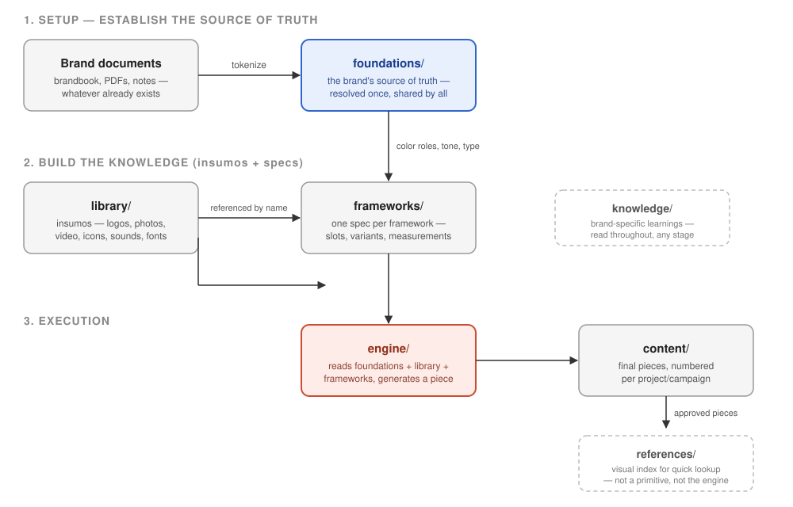

# Codex

**Codex es la codificación de una marca en código.** Es una metodología para
generar piezas de publicidad a escala, de forma **agéntica**: se toma el design system de una marca
(paleta, tipografía, logo, tono, plantillas) y se convierte en prompts y tokens estandarizados, para
que una IA pueda generar las piezas gráficas (HTML → PNG/JPEG) sin diagramar cada una a mano.

> Este repo es la **estructura estándar** (propuesta) que cualquier proyecto de marca en Codex debería
> adoptar — todavía en construcción y sujeta a ajustes.

## La idea central

El diseño de una marca se documenta una sola vez, en un formato que tanto un humano como una IA
pueden leer sin ambigüedad. A partir de esa especificación, un motor genera cualquier cantidad de
piezas — distintos tamaños, canales, variantes de copy — sin que nadie tenga que diagramarlas una
por una a mano.

## Cómo funciona, en 3 niveles

1. **Foundations** — lo que nunca cambia de una pieza a otra: paleta, tipografía, logo, tono, límites
   legales. Se resuelve una sola vez, al principio de cada marca.
2. **Frameworks** — cada estructura visual reutilizable (ej. "producto + logo + texto abajo") se
   documenta en detalle: qué elementos tiene, cómo se comporta el texto largo, las medidas exactas de
   cada tamaño que cubre. Un framework, un documento.
3. **Engine** — el motor que lee esos documentos y genera las piezas reales. Se construye después de
   que foundations y frameworks ya están documentados, nunca antes.

## El flujo completo

El trabajo con el agente pasa siempre por dos etapas:

1. **Setup** — aplica cada vez que el conocimiento de la marca está incompleto, no solo cuando el
   proyecto está vacío (por ejemplo: hay foundations pero no frameworks, o hay frameworks pero
   faltan logos o fuentes). El agente revisa qué hay, te cuenta en lenguaje simple qué falta, y te
   pide todo lo que tengas (brandbook, manuales, PDFs, notas, logos, fotos, videos, íconos,
   fuentes, links de Figma, piezas de referencia) en cualquier formato, aunque esté desordenado.
   Él lo organiza, pregunta solo por los huecos —uno a la vez, sin inventar nada— y sigue
   recibiendo material hasta que digas que no tenés más. Para cerrar, arma una pieza de prueba con
   los datos reales y te la muestra para aprobación.
2. **Ejecución** — con el Setup cerrado (o si el proyecto ya estaba completo), el agente produce
   las piezas: las construye en HTML a partir de los frameworks, las exporta a imagen y las
   entrega organizadas por proyecto y tamaño. Si en el camino aparece algo que no está documentado
   (un framework nuevo, un logo que falta, un valor sin definir), vuelve al Setup solo para ese
   hueco y después sigue.

## Qué hay en este proyecto

| Carpeta        | Qué guarda                                                                     |
| -------------- | ------------------------------------------------------------------------------ |
| `foundations/` | Los tokens de la marca, en 4 archivos: `COLORS.md` (paleta), `FONTS.md` (tipografía), `LOGOS.md` (uso del logo), `COPYS.md` (tono y legal), más `BRAND.md`, un índice/resumen de la marca que la IA lee primero. Se crean durante el Setup a medida que llega la información |
| `frameworks/`  | Un documento por framework, con su especificación completa                     |
| `resources/`   | Recursos (insumos): logos, fotos, videos, íconos, sonidos, fuentes de la marca |
| `content/`     | Las piezas ya generadas, organizadas por proyecto/campaña                      |
| `references/`  | Miniaturas/montajes de frameworks ya aprobados, para consulta visual rápida    |
| `knowledge/`   | Conocimiento específico de esta marca                                          |
| `engine/`      | El motor que genera las piezas                                                 |

## Cómo se opera esto

Este proyecto está pensado para trabajarse junto a un agente de IA que sigue las instrucciones de
`CLAUDE.md` y las reglas de `RULES.md`. Un humano aporta el criterio de marca (brandbook,
aprobaciones, copy); la IA tokeniza, documenta cada framework, y genera las piezas — siempre
preguntando antes de inventar un valor, y pidiendo aprobación antes de escalar a más variantes o
tamaños. El detalle completo de cómo opera la IA vive en `.claude/knowledge/`.
